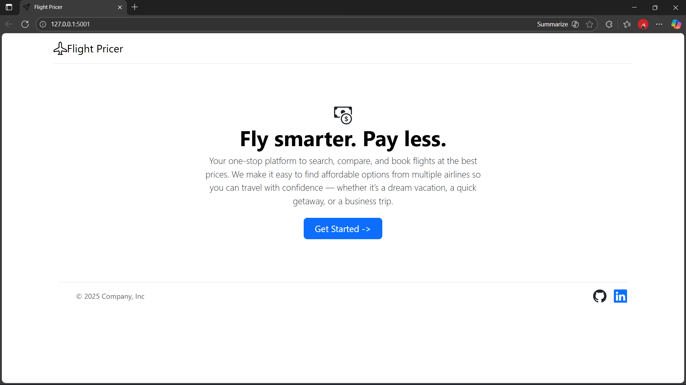
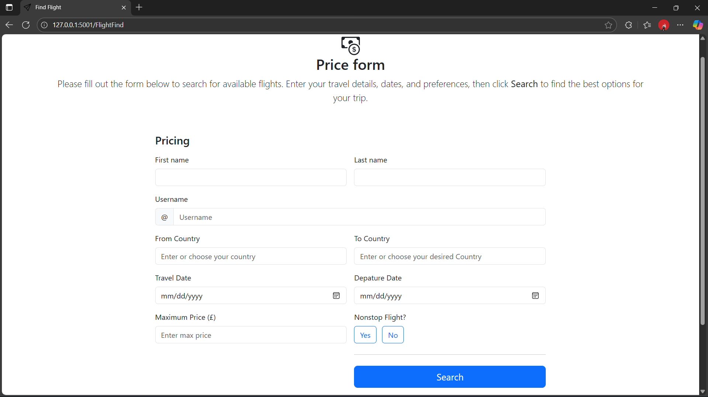
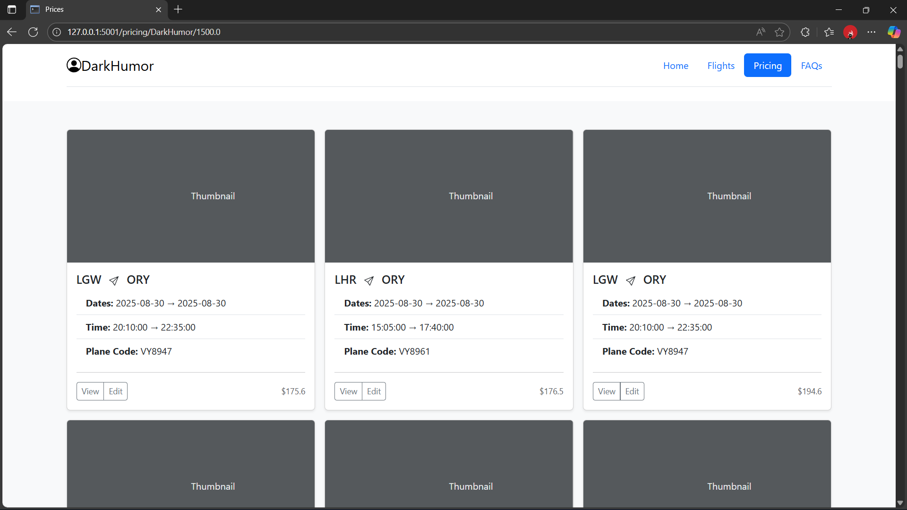

# ✈️ Flight Price Finder

A web application to search, compare, and display flight prices using the Amadeus API.  
Easily find the best flights between cities, filter for nonstop options, and view results in a modern web interface.

---

## 🚀 Features

- **Flight Search:** Enter origin, destination, and travel dates to find available flights.
- **Nonstop Option:** Filter results to show only nonstop flights, or include flights with stops.
- **Price Filtering:** Set a maximum price to see only flights within your budget.
- **User-Friendly UI:** Clean, responsive interface built with Flask and Bootstrap.
- **Graceful Fallback:** If no nonstop flights are found, the app automatically searches for flights with stops and notifies the user.
- **Data Storage:** Saves flight search results to a JSON file for further analysis.

---

## 🛠️ Technologies Used

- **Backend:** Python, Flask
- **Frontend:** HTML, Bootstrap 5
- **API:** Amadeus Flight Offers (sandbox)
- **Data:** JSON

---

## 📸 Screenshots




---

## ⚡ Getting Started

### 1. Clone the Repository

```bash
git clone https://github.com/YOUR-USERNAME/flight-price-finder.git
cd flight-price-finder
```

### 2. Install Dependencies

```bash
pip install -r requirements.txt
```

### 3. Configure Amadeus API

- Sign up at [Amadeus for Developers](https://developers.amadeus.com/) and get your API credentials.
- Set your credentials in your environment or directly in your code as needed.

### 4. Run the Application

```bash
python server.py
```

- Open your browser and go to [http://localhost:5001](http://localhost:5001)

---

## 📝 Usage

1. Fill in your trip details (origin, destination, dates, price, nonstop preference) on the search page.
2. Submit the form to view available flights.
3. If no nonstop flights are found, you'll be notified and shown flights with stops.
4. Results are displayed and saved to `flight_data.json`.

---

## 🤝 Contributing

Contributions are welcome!  
Feel free to open issues or submit pull requests for improvements.

---

## 📄 License

This project is licensed under the MIT License.

---

## 🌐 Connect

- [LinkedIn](https://www.linkedin.com/in/michealudekwu)
- [GitHub](https://github.com/Michealudekwu/Flight-Pricings)
